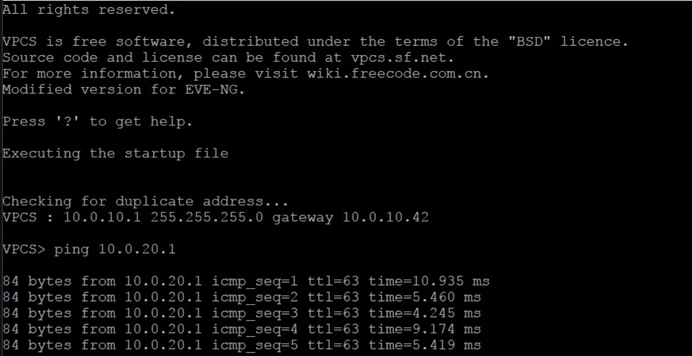

### Описание топологии

Протокол STP активирован в сети. Распределительный коммутатор (R3) выступает в роли корневого, а связь между коммутаторами уровня доступа (R1 и R2) заблокирована. Конечные пользователи подключены к R1 и R2. Распределительный коммутатор (R3) соединен с маршрутизатором (R4). Каждый клиент располагается в отдельном VLAN: Client1 (VPC_1) присутствует в VLAN 10 и подсети 10.0.10.0/42, а Client2 (VPC_2) — в VLAN 10 и подсети 10.0.20.0/42.

### Подтверждение работоспособности

### В случае разрыва связи 

